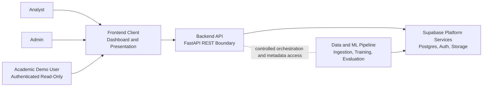
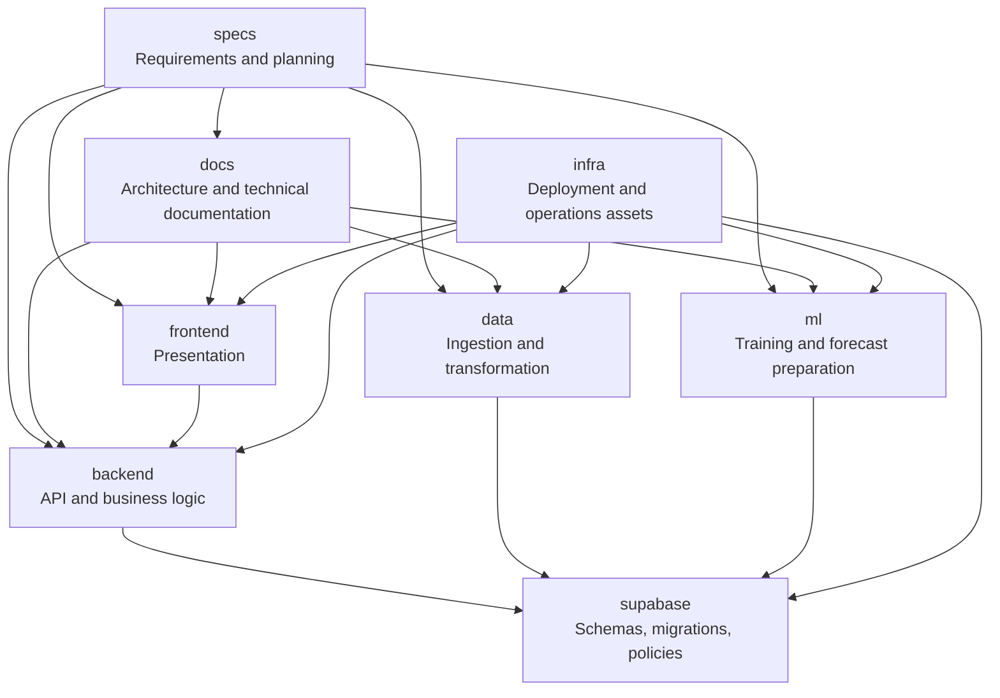
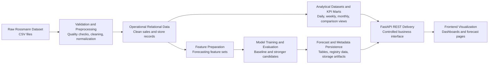

# Detailed Architecture for the Analytical Platform for an Online Store with Sales Forecasting

## 1. Title and Document Purpose

This document defines the detailed target architecture of the Analytical Platform for an Online Store with Sales Forecasting. It exists as a standalone architectural reference because the project requires more than an implementation checklist: it needs a defensible, coherent system design that can guide development decisions, justify technical trade-offs, and support academic evaluation. The repository currently remains in Phase 1, Repository Foundation, but the platform must be designed against the approved MVP target state so that later implementation phases are consistent, reviewable, and traceable to an explicit architectural baseline.

The document serves two audiences at the same time. For implementation, it acts as a decision source for future planning artifacts such as `/speckit.plan` and `/speckit.tasks`, reducing ambiguity around boundaries, interfaces, security rules, data flow, and deployment assumptions. For thesis defense, it provides a narrative that explains why the selected architecture is technically sound, proportionate to the project scope, and appropriate for a graduation project implemented by a small team, specifically a single developer operating under time and operational constraints.

This architecture is intentionally implementation-aligned rather than purely theoretical. It reflects the technology and module choices already established in the repository documentation: a headless architecture, a modular monolith delivery model, a FastAPI REST backend, Supabase as the database and identity foundation, Python-based data and machine learning pipelines, and a frontend separated from data engineering and business logic concerns. The purpose of this document is therefore not to speculate about abstract enterprise patterns, but to define a realistic architecture that can be built, defended, and maintained.

## 2. System Vision

The platform is a combined analytical and forecasting system for retail decision support. Using the Rossmann Store Sales dataset as the project data foundation, it is intended to help users inspect store performance, calculate business KPIs, and generate short-term sales forecasts that can support inventory planning, promotional decisions, and operational analysis. The system is not only a reporting dashboard and not only a forecasting engine; it is a unified analytical platform in which descriptive analytics and predictive analytics reinforce each other.

The business problem addressed by the platform is the gap between historical reporting and forward-looking action. Historical sales analysis alone can explain what happened, but it does not guide near-term operational planning. Forecasting alone can generate projected values, but without surrounding KPI context it becomes difficult to judge whether the forecast is credible, business-relevant, or actionable. In a retail setting, store managers and analysts need both perspectives: current and past performance trends, and structured estimates of likely future demand.

Combining KPI analytics and sales forecasting in one platform is therefore an architectural choice, not merely a feature aggregation decision. The same validated data foundation supports both analytical views and predictive outputs. The same business entities, especially stores, dates, promotions, holidays, and sales measures, must be interpreted consistently by both the analytical and forecasting paths. A shared platform avoids duplicated ingestion pipelines, inconsistent definitions of sales metrics, and conflicting interpretations of the same retail events. Academically, this integration strengthens the thesis because it demonstrates end-to-end data lifecycle design: ingestion, validation, analytical modeling, predictive modeling, secure serving, and presentation.

The system vision is also shaped by the realities of a graduation project. The platform must be technically serious enough to demonstrate software architecture, backend engineering, data engineering, and applied machine learning, but constrained enough to remain buildable within the scope of the approved MVP. For that reason, the vision emphasizes a single coherent product with clear module boundaries rather than a broad, multi-product ecosystem.

## 3. Architecture Drivers

The architecture is driven by a combination of functional, non-functional, academic, operational, and security concerns. These drivers are not independent; the selected design must satisfy them together without introducing unnecessary complexity.

| Driver Category | Primary Drivers | Architectural Consequence |
|---|---|---|
| Functional drivers | KPI retrieval, store comparison, forecast generation, authenticated access, data ingestion, forecast delivery via API | Requires a backend orchestration layer, durable persistence, explicit data pipelines, and a consistent API contract |
| Non-functional drivers | Maintainability, predictable performance, scalability to Rossmann-scale data, reliability, testability | Favors modular boundaries, pre-aggregated KPI marts, typed schemas, and clear separation of online and offline workloads |
| Academic drivers | Thesis defensibility, traceable decisions, reproducibility, explainability of system behavior | Requires documented rationale, reproducible pipelines, explicit trade-off discussion, and architecture diagrams |
| Operational drivers | Small-team delivery, low infrastructure overhead, manageable deployment, phased implementation | Favors modular monolith over microservices, managed database/auth foundation, and limited environment complexity |
| Security drivers | No secrets in frontend, controlled data exposure, authorization enforcement, auditability, defense in depth | Requires backend-first access, Supabase Auth plus RLS, careful key handling, and validated API boundaries |

From a functional perspective, the architecture must support two distinct but connected usage patterns. The first is analytical access to historical and aggregated data, where users retrieve KPIs, compare stores, and inspect trends over chosen time windows. The second is forecast retrieval, where users request or access persisted forecast results along with model metadata and accuracy context. These use cases require stable business entities, structured data contracts, and role-aware access paths.

From a non-functional perspective, the platform must be understandable, modular, and performant without becoming over-engineered. Rossmann data volume is large enough to justify careful data modeling, indexing, and analytical aggregation, but not large enough to require distributed systems complexity at the MVP stage. The architecture must support fast dashboard loading and bounded forecast-serving latency while keeping the implementation comprehensible to reviewers and maintainers.

Academic drivers are unusually important in this project. The system is expected to demonstrate good architecture, not only successful execution. That means the design must be defensible in terms of reasoning, not just outcome. Reviewers should be able to see why the chosen technologies fit the problem, why the system is partitioned the way it is, how reproducibility is achieved in the ML flow, and how security boundaries are enforced. The architecture must therefore make hidden assumptions explicit.

Operational drivers favor simplicity with discipline. A graduation project is not a large product organization with independent platform, data, backend, and ML teams. The architecture must be realistic for a small team and ideally for one developer. This favors fewer deployable units, stronger contracts inside one repository, and use of managed platform services where they reduce setup and maintenance burden without hiding important architectural decisions.

Security drivers further constrain the design. Because the project deals with authentication, forecast outputs, administrative functions, and stored analytical data, the architecture must assume that even an academic platform can be misused if boundaries are weak. Secure-by-default design therefore means limited data exposure, server-side policy enforcement, validated inputs, least-privilege keys, and traceability of access.

## 4. Architectural Style and Rationale

The selected architectural style is a headless modular monolith with backend-first business logic. This means the platform is delivered as a small number of tightly related components within one repository and operational boundary, while still enforcing clear internal separation between presentation, application services, domain logic, data engineering, machine learning, persistence, and infrastructure concerns.

Headless architecture was chosen because the platform’s primary stable boundary is not the user interface but the business API. The frontend dashboard is important, but it is not the architectural center of gravity. The architectural center is the FastAPI backend, which exposes curated business data and forecast outputs through controlled REST endpoints. This choice ensures that the same backend contracts can serve the main web frontend, automated tests, internal analytical clients, and future consumers without duplicating rules in multiple UI-specific implementations. It also creates a clearer thesis narrative: the frontend presents information, while the backend owns meaning, access control, and business rules.

The modular monolith approach was chosen instead of microservices because the problem scope does not justify distributed operational complexity. Microservices would introduce service discovery, inter-service authentication, distributed logging, failure propagation, deployment coordination, and data consistency concerns that add more architectural overhead than value at the MVP stage. The project’s scale, team size, and academic context favor a single deployable application boundary with strong module separation over a network of independently deployed services. A modular monolith still supports disciplined decomposition, but it keeps those boundaries intra-repository and intra-system rather than network-distributed.

Backend-first design was chosen because the platform has meaningful business rules that must not be trusted to the frontend. Access to stores, interpretation of roles, validation of date ranges, filtering rules, KPI definitions, forecast retrieval policies, and audit logging all belong in trusted backend code or backend-controlled database policies. If such rules were placed in the frontend, the system would become harder to secure, harder to test consistently, and harder to defend academically. A backend-first architecture also aligns with the headless principle by ensuring that all privileged or business-significant behavior is concentrated behind one interface.

This architecture fits a graduation project because it balances rigor with feasibility. It is strong enough to demonstrate modern engineering practice, including API design, schema discipline, security layering, data processing, and ML integration, but restrained enough to avoid spending the majority of project time on platform overhead. It also fits a small team because a modular monolith is easier to reason about, debug, document, and demonstrate than a distributed system. The choice is therefore both technically and academically defensible: complexity is introduced where it creates value, not where it merely signals sophistication.

## 5. High-Level System Context

At the highest level, the platform has three categories of actors and four major system-side dependencies. The human actors are the analyst, the administrator, and the academic demo user. The analyst uses the system to inspect KPIs, store trends, and forecast results. The administrator manages operational aspects such as user access, curated demo access, and system oversight. The academic demo user is an authenticated but restricted read-only user whose purpose is to support safe project presentation without granting privileged capabilities or unrestricted data access.

The primary technical participants are the frontend client, the backend API, the Supabase platform services, and the data and ML pipeline. The frontend client is the presentation interface, likely implemented with Next.js, and is responsible for rendering dashboards and interaction flows. The backend API is the trusted application boundary implemented with FastAPI. Supabase provides PostgreSQL persistence, authentication, row-level security support, and object storage. The data and ML pipeline is the offline processing side of the system, responsible for ingestion, validation, transformation, feature preparation, training, evaluation, and forecast artifact production.

This system context shows two important boundaries. The first is the trust boundary between users and the system: all human actors interact through the frontend, but the frontend itself is not trusted to enforce business rules. The second is the internal responsibility boundary: online requests flow through the backend API, while batch and experimental processing occur in the data and ML pipeline. Supabase is shared infrastructure, but it is not the application layer; it is a foundation service used by trusted server-side components. This separation is academically useful because it demonstrates that the platform is organized by responsibilities rather than by superficial technology layers.

The textual system context is therefore straightforward. Users authenticate and interact with the presentation client. The presentation client calls the backend API. The backend API enforces policies, validates requests, retrieves curated data from Supabase, and returns structured responses. Offline pipeline processes ingest and transform raw Rossmann data, populate analytical structures, train models, evaluate them, and write outputs back to controlled persistence and storage areas. The frontend never directly executes the data engineering or machine learning concerns, and it never becomes the source of truth for business decisions.

## 6. Main Architectural Layers

The architecture is organized into seven principal layers. These layers are logical rather than physical deployment units, but they create the primary reasoning model for the platform. Clear layer definitions are necessary because the project combines data engineering, analytics, API delivery, and machine learning, all of which can easily become entangled without an explicit boundary model.

The presentation layer is responsible for user interaction and visualization. It renders dashboards, filters, forms, comparison views, and forecast displays. Its inputs are API responses and authentication state. Its outputs are user actions expressed as API requests. This layer must not interpret business policy, compute authoritative KPIs, or derive privileged results from raw storage access.

The API and application layer is the entry point for all trusted online behavior. In this project it is implemented by FastAPI and contains routing, request validation, response shaping, authentication context extraction, orchestration logic, and consistent error handling. This layer translates external requests into application use cases. It should not contain heavy analytical computation or training logic inline with request processing; instead, it coordinates access to deeper services and persisted outputs.

The domain and business logic layer contains the rules that define what the system means. This includes KPI definitions, authorization decisions beyond raw authentication, rules for which stores a user can access, forecast-serving policies, accepted aggregation options, and the interpretation of analytical concepts exposed through the API. It is the part of the architecture that most strongly embodies the backend-first principle. If a rule changes here, the frontend should not need to re-implement it.

The data processing layer handles ingestion, validation, preprocessing, data quality control, transformation, and loading. It is responsible for turning raw Rossmann files into consistent, queryable, and analytically meaningful data assets. This layer is not user-facing and should be run as controlled jobs or scripts rather than request-time logic. Its role is foundational because both KPI computation and feature generation depend on data discipline.

The ML layer handles feature preparation, training, evaluation, model selection, artifact generation, and controlled inference support. It should be separated from the online API path because training and experimentation are resource-intensive and have different lifecycle requirements than request-response serving. The API may expose forecast results, but those results are produced by a separate ML workflow whose outputs are persisted and governed.

The persistence, authentication, and storage layer is centered on Supabase. PostgreSQL stores operational and analytical relational data, Supabase Auth manages identity, row-level security provides database-level filtering support, and storage holds model artifacts or large derived files. This layer must be treated as foundational infrastructure rather than as the place where application business workflows are hidden from the backend. Database policies and schemas support the architecture; they do not replace the application layer.

The observability and operations layer provides logging, health signaling, error visibility, and environment management. It spans the backend, data pipeline, ML jobs, and deployment context. Without this layer, the system may function during ideal conditions but remain difficult to diagnose, defend, or demonstrate. In an academic project, observability is part of architectural maturity because it shows that the system is designed for controlled operation rather than only for happy-path output.

The boundaries between these layers must remain explicit. The presentation layer may request business outcomes, but it cannot become a business engine. The API layer may orchestrate online use cases, but it should not perform offline pipeline work inside user requests. The domain layer defines rules, while the data and ML layers produce trusted inputs for those rules. The persistence layer stores and constrains data, but it does not replace the application’s reasoning responsibilities. This layered model is central to keeping the modular monolith disciplined.

## 7. Module Boundaries

The repository is organized into the modules `frontend`, `backend`, `data`, `ml`, `docs`, `infra`, `specs`, and `supabase`. Each module has a primary responsibility and a set of explicit prohibitions. These prohibitions are as important as the responsibilities because modular monoliths remain healthy only when modules do not silently absorb responsibilities that belong elsewhere.

The module diagram highlights three different relationship types. `specs` and `docs` guide design and implementation but are not runtime modules. `frontend` and `backend` define the online product path. `data`, `ml`, `supabase`, and `infra` support ingestion, persistence, controlled model lifecycle, and deployment. Most importantly, the diagram shows that the frontend talks to the backend rather than bypassing it, and that `data` and `ml` operate against controlled persistence rather than directly against the UI. This is the repository-level expression of the headless modular monolith.

| Module | Primary responsibility | Must do | Must not do |
|---|---|---|---|
| `frontend` | Presentation and user interaction | Render dashboards, invoke backend APIs, manage auth-aware navigation, display analytics and forecasts | Must not contain authoritative business rules, direct privileged database access, or secret handling |
| `backend` | API delivery and business logic | Validate requests, enforce policies, expose REST endpoints, orchestrate data and forecast retrieval, shape response contracts | Must not delegate core authorization to the frontend or embed offline training pipelines into request handling |
| `data` | Ingestion, validation, preprocessing, KPI preparation | Load Rossmann inputs, validate quality, transform data, populate analytical structures, record processing outcomes | Must not become a user-facing API or own application authorization logic |
| `ml` | Training, evaluation, feature preparation, forecast artifact production | Train baseline and stronger models, evaluate them, persist metadata, generate forecast outputs for serving | Must not bypass controlled persistence or expose ad hoc experimental outputs directly to end users |
| `docs` | Stable architecture and technical explanation | Document structure, rationale, and operational expectations | Must not become the only place where implementation-critical behavior exists without corresponding specs or code |
| `infra` | Environment and deployment support | Define containers, CI assumptions, deployment assets, operational configuration patterns | Must not embed business rules or data transformation logic |
| `specs` | Source of scope, requirements, and planning intent | Define approved features, constraints, tasks, contracts, and phase plans | Must not drift away from implemented architecture or become a hidden runtime configuration channel |
| `supabase` | Database, auth, storage, migrations, and database-level policies | Contain schema evolution, RLS policies, controlled storage conventions, and database-side support objects | Must not replace backend business orchestration or expose broad unrestricted schemas to clients |

These module rules are especially important for later phases. If the frontend starts implementing KPI calculations, the headless architecture is weakened. If the backend pushes all logic into SQL or Supabase RPC only to simplify code temporarily, the application boundary becomes harder to reason about. If the ML module writes directly to UI-facing objects without metadata discipline, reproducibility and auditability degrade. The purpose of this section is therefore to preserve architectural intent before implementation pressure increases.

## 8. End-to-End Data Flow

The end-to-end data flow begins with the raw Rossmann dataset and ends with an authenticated user viewing historical analytics or forecast results in the frontend. The architectural objective is to make every stage explicit, reproducible, and bounded. This is essential both for implementation quality and for thesis defense, because reviewers typically challenge data lineage, transformation integrity, and the legitimacy of model outputs.

The first stage is raw data ingestion. The platform ingests the Rossmann CSV files, primarily `train.csv` and `store.csv`, with `test.csv` and related reference files treated as auxiliary inputs where useful for benchmark alignment or demonstration. These files enter the system as raw, untrusted sources. The ingestion workflow must therefore verify file structure, expected columns, data types, date parseability, null patterns, duplicate candidates, and basic referential integrity between sales records and store metadata. Raw files are inputs to the platform, not immediately queryable business truth.

The second stage is validation and preprocessing. Validation rules identify missing values, inconsistent records, implausible values, and logical conflicts such as closed stores with non-zero sales. Preprocessing then standardizes types, handles missing fields according to documented rules, creates normalized representations of dates and categorical variables, and prepares the dataset for both analytics and ML use. This stage should produce explicit validation outcomes so that failed or questionable inputs are visible, not silently ignored.

The third stage is transformation into analytical datasets and KPI marts. Cleaned operational-level records are loaded into controlled relational tables. From these tables, analytical transformations produce daily, weekly, monthly, and cross-store KPI structures that support fast and consistent dashboard queries. KPI marts are not arbitrary denormalized tables; they are curated analytical assets whose definitions should remain stable across UI changes. Their existence is justified by both performance and semantic consistency.

The fourth stage is feature preparation for machine learning. The ML workflow draws from cleaned historical sales records, store attributes, and analytical context to construct forecasting features such as lagged sales values, seasonality indicators, holiday context, promotion context, and store characteristics. Feature preparation must be deterministic where feasible and version-aware so that model training can be tied back to a specific data state and feature-generation configuration.

The fifth stage is model training and evaluation. A baseline model is trained first to provide a defensible reference point. Stronger candidate models, such as Prophet and feature-based approaches like XGBoost, are then trained on the prepared data. Evaluation records accuracy metrics, confidence assumptions, and comparison outcomes. The architecture must preserve this evidence because the platform’s forecasting capability is only academically defensible if model claims are traceable to actual evaluation, not informal observation.

The sixth stage is forecast generation and persistence. Approved or active forecast outputs are generated offline and written back into controlled persistence. This may include forecast result tables, evaluation metadata, model registry data, and artifact files in storage. The API should serve persisted, governed forecast outputs wherever possible rather than triggering heavyweight retraining during ordinary user requests. This keeps user-facing performance predictable and ensures that forecast results are reproducible and auditable.

The final stage is API delivery and frontend visualization. The frontend requests historical sales, KPIs, comparisons, or forecast results through FastAPI endpoints. The backend enforces authentication and authorization, validates filters, retrieves curated data from controlled schemas, and returns structured responses. The frontend then renders charts, tables, and explanatory metrics. At no point should the frontend bypass this boundary to retrieve privileged business data or model artifacts directly.

This flow diagram expresses the most important academic defense point in the system: forecast outputs are not isolated black-box predictions detached from the rest of the platform. They emerge from the same validated data foundation that also supports KPI analytics. The diagram also clarifies operational boundaries. Data and ML work occur upstream of user-facing API delivery, while the API acts as the controlled presentation boundary for both analytical and predictive data products. That is precisely why the architecture combines analytics and forecasting in one platform without collapsing them into one undifferentiated module.

## 9. Database and Data Architecture

Supabase Postgres is the central persistence foundation of the platform. Its role is broader than storing rows, but narrower than replacing the application. It provides durable relational storage for cleaned source-aligned records, analytical structures, access-control metadata, and forecast-related metadata. It also provides authentication support and object storage integration through the broader Supabase platform. Choosing Supabase allows the project to rely on a managed PostgreSQL foundation while keeping architectural attention on schema design, security, and controlled exposure rather than infrastructure provisioning.

The database should be organized into logical schemas with different exposure levels and responsibilities. The `auth` schema remains managed by Supabase for identity concerns. The `internal` schema should contain ingestion-state tables, processing run metadata, staging objects, and other restricted structures that are not intended for direct external consumption. The `analytics` schema should contain curated marts and views used to support KPI retrieval and comparison workloads. The `ml` schema should contain forecast result tables, model metadata, evaluation records, feature-set references, and other machine-learning-related relational objects. The `public` schema, if used at all, should be deliberately minimal and limited to controlled, API-facing objects that are safe to expose through backend contracts. Exposed schemas must be controlled because schema exposure is a security and coupling decision, not only a database organization detail.

This separation matters for both safety and maintainability. If all tables live in one broadly exposed schema, it becomes too easy to leak internal implementation details, couple the frontend to unstable persistence structures, or let experimental ML outputs appear as stable business data. By contrast, logical schema separation allows the architecture to express the distinction between operational truth, analytical derivatives, and machine learning artifacts. It also helps academic explanation because the database design reflects system purpose rather than accidental implementation order.

Tables, views, and KPI marts should be used intentionally. Base tables store cleaned operational data and durable system records such as stores, sales records, forecast results, access mappings, and run metadata. Views should be used where a stable read abstraction is useful and where the underlying computation is simple enough to remain understandable and performant. KPI marts are justified when repeated analytical queries would otherwise perform unnecessary aggregation work or when the system needs stable, explicitly governed analytical definitions. Marts should therefore represent approved business metrics, not ad hoc caching of arbitrary frontend needs.

Migration strategy should be incremental, explicit, and versioned in the `supabase` module. Schema changes must be represented as reviewed migrations rather than informal manual database edits. This is important for repeatability, local environment reconstruction, and thesis defensibility. It demonstrates that the system’s persistence model evolves under controlled change management rather than through undocumented database mutation.

Data versioning assumptions must also be clear. The Rossmann source files are static from the project perspective, but the architecture should still record which dataset version or source snapshot produced a given ingestion run, analytical refresh, or model training run. For academic rigor, forecast outputs and evaluation results should be traceable to specific data preparation runs and configuration contexts. Full enterprise-grade data lake versioning is unnecessary for the MVP, but lineage references and run identifiers are necessary.

Operational data and analytical data should be separated logically even when they share one PostgreSQL instance. Operational data includes cleaned base entities, access-control mappings, and system records that reflect the core relational truth of the platform. Analytical data includes aggregated KPI marts, comparison structures, and read-optimized views. This separation avoids confusing mutable source-aligned data with derived decision-support assets. It also keeps update patterns clearer: operational tables are loaded and maintained as canonical inputs, while analytical structures are rebuilt or refreshed as derived products.

## 10. API Architecture

FastAPI serves as the central application boundary and is the correct place to expose the platform’s online contract. Its role is not only to transport JSON over HTTP, but to embody the platform’s policy, validation, response discipline, and use-case orchestration. This is especially important in a headless architecture, where the API is the stable cross-module interface that protects the rest of the system from presentation-specific coupling.

The API should follow an explicit versioning strategy rooted at `/api/v1`. Versioning at the path level is appropriate for this project because it is easy to explain, straightforward to test, and highly visible in documentation and demos. It also provides a stable convention for future compatibility management if contracts evolve. Even if only one version exists during the MVP, the presence of `/api/v1` makes the boundary explicit and future-ready without introducing significant complexity.

Endpoint grouping should mirror the main business domains of the platform. The canonical groups are `auth`, `stores`, `sales`, `kpis`, `forecasts`, `admin`, and `health`. `auth` supports authentication-aware context and session-related backend flows. `stores` exposes store listings and store-specific metadata according to authorization scope. `sales` provides historical sales retrieval with date filtering and aggregation choices. `kpis` exposes curated analytical results rather than raw analytical computation instructions. `forecasts` serves forecast outputs, model context, and forecast retrieval workflows. `admin` contains restricted operational actions such as access management or controlled refresh actions. `health` provides system health and readiness signaling for deployment and demo use.

Request and response schema discipline is a core architectural rule. Every endpoint should use explicitly defined request validation and response models. Inputs such as dates, store identifiers, aggregation levels, pagination parameters, and filtering options must be validated before application logic runs. Responses should follow consistent shapes so that the frontend and future consumers can rely on predictable contracts. Error responses should also follow a consistent envelope with machine-readable error codes and human-readable descriptions, because inconsistent failure contracts reduce both reliability and demonstrability.

Filtering, pagination, and validation must be treated as API responsibilities, not UI conveniences. Historical sales retrieval and store comparison endpoints can return large result sets, so pagination and constrained filtering protect both performance and accidental misuse. Validation prevents invalid or abusive queries from propagating into business logic or database access. These concerns belong in the API because they define how the platform can be asked for information, not how a given interface chooses to display it.

Health endpoints are part of the architecture, not operational afterthoughts. At minimum, the API should expose liveness and basic readiness signals that indicate whether the application can serve requests and whether critical dependencies, especially database connectivity, are functioning at a minimum level. For academic demonstration, health visibility is useful because it proves the system can be reasoned about operationally, not only functionally.

The distinction between admin and user-facing endpoints must remain sharp. User-facing endpoints allow access to historical data, KPIs, and forecasts within the authenticated user’s scope. Admin endpoints are restricted to operational tasks and privileged access management. Combining these concerns into the same permissive endpoint surface would weaken both security and clarity. By contrast, explicit endpoint grouping supports least privilege and makes access policy easier to explain to reviewers.

REST is the right API boundary here because the platform’s core interactions are request-response retrieval and controlled submission of business operations such as requesting forecast access or querying KPI windows. REST over FastAPI is simpler and more transparent than exposing database-native APIs directly to the frontend, and more appropriate than introducing GraphQL or event-driven interfaces for an MVP whose needs are well-defined and bounded. It also aligns naturally with OpenAPI generation, which strengthens documentation quality and integration discipline.

## 11. Security Architecture

The security architecture assumes that the frontend is an untrusted environment, authenticated users may attempt to access data outside their allowed scope, administrative functions carry higher risk than ordinary analytical viewing, and misconfigured database exposure can leak internal or privileged information. These threat assumptions are modest but realistic. A secure-by-default design must therefore protect against accidental overexposure, not only malicious attack in the most extreme sense.

No secrets may exist in the frontend or in committed repository files. Public client configuration may include non-sensitive identifiers such as public URLs or public anonymous keys only where appropriate to support authentication flows, but privileged secrets such as the Supabase service-role key, database passwords, storage administration keys, or internal signing keys must remain in trusted server-side or pipeline environments only. This rule is both operationally necessary and academically important because it demonstrates awareness of client-server trust boundaries.

Supabase Row-Level Security is a database-level protection layer, but it is not the sole enforcement mechanism. RLS policies should ensure that users can only access rows for stores or resources within their granted scope. However, backend authorization must still exist because the backend controls higher-level business actions, role interpretation, endpoint grouping, administrative behavior, and API-level error semantics. Defense in depth means the backend blocks unauthorized use cases before database access, while RLS reduces the blast radius of misrouted or overly broad queries.

Service-role key handling requires strict control. The service-role key should be available only to trusted backend services and controlled data or ML jobs that truly require privileged access for ingestion, migration, policy-aware maintenance, or artifact management. It must never be exposed to the browser, embedded in frontend bundles, or passed through user-controlled paths. The architecture should assume that any key exposed to the client is public by definition.

Input validation is a security concern as much as a correctness concern. Every externally supplied field, including query parameters, body payloads, pagination inputs, sorting instructions, and identifier values, must be validated for type, range, allowed enumeration, and business plausibility. This reduces the risk of malformed requests, abuse of filtering interfaces, excessive queries, and indirect injection into downstream systems.

Auditability, logging, and traceability are part of the security architecture because access control without evidence is weak. The system should log authentication-relevant events, authorization failures, admin actions, ingestion runs, training runs, forecast publication events, and significant API access patterns. Logs should not expose secrets or raw sensitive payloads, but they should contain enough context to trace who accessed which protected capability and when. For academic demonstration, this is a strong defense point: the system is designed to explain its behavior after the fact, not only perform it.

The main API security risks in this architecture are over-trusting the frontend, bypassing the backend with direct data access, overexposing schemas, misusing privileged keys, and allowing inconsistent authorization between API and database layers. The mitigation principles are straightforward: keep the backend as the policy boundary, minimize exposed schemas, apply least privilege to all secrets and credentials, validate inputs early, log important security-relevant events, and separate administrative interfaces from general analytical access. These principles scale well from an academic MVP to a production-minded system.

## 12. Machine Learning Architecture

The machine learning architecture is designed around a controlled progression from baseline forecasting to stronger candidate models. This is important academically because a forecasting system is not credible if it presents only one complex model without a comparison point. The baseline model serves as a reference for both practical fallback behavior and scientific evaluation. A simple historical or statistical baseline, such as recent-period averaging or seasonality-aware naive forecasting, establishes the minimum standard that stronger models must outperform.

The stronger candidate model concept is aligned with the project research and may include Prophet, XGBoost-based feature-driven forecasting, or a combination of both. Prophet is valuable because it provides interpretable handling of trend and seasonality. XGBoost is valuable because it can exploit richer engineered features and may capture nonlinear patterns more effectively. The architecture should therefore support model comparison and possibly a selected active model strategy, rather than hard-coding one model as universally correct from the start.

Training belongs to an offline pipeline, not to ordinary API requests. The training pipeline should load prepared features, split data according to a time-aware evaluation strategy, train the baseline and stronger candidates, compute evaluation metrics such as MAPE, RMSE, and MAE, record the configuration and data references used, and persist both model outputs and metadata. Separating training from online serving reduces latency risk, improves reproducibility, and keeps experimentation from destabilizing user-facing behavior.

The evaluation pipeline is a first-class architectural concern. Each training run should produce evaluation records that identify the model variant, feature configuration, dataset reference, training window, validation window, and resulting metrics. This provides the evidence needed to justify model selection and to explain why a particular forecast result should be considered trustworthy within the limits of the dataset and methodology. Without this evaluation discipline, the platform’s forecasting layer would be difficult to defend academically.

Artifact storage should be split between relational metadata and stored files. Supabase Storage is suitable for serialized model artifacts, generated reports, or packaged forecast artifacts that do not fit naturally into ordinary relational tables. Postgres, especially in the `ml` schema, should store model metadata, artifact references, evaluation metrics, active-model flags, and forecast publication records. This split keeps large binary or file-based assets separate from structured queryable governance data.

Inference flow should remain controlled and predictable. For the MVP, the preferred serving path is to expose persisted forecast results and associated metadata through the API. If on-demand inference is later introduced for bounded use cases, it should still operate through trusted backend orchestration and recorded metadata, not as opaque ad hoc computation in the frontend. The key architectural principle is that user-visible forecasts are governed artifacts, not transient, untracked numbers.

Experimentation must remain separate from production inference. The `ml` module may support notebooks, experiments, or alternative candidate models during development, but only approved and recorded outputs should enter the serving path. This separation protects the integrity of user-facing results and makes the architecture defensible: reviewers can distinguish between research activity and the controlled system behavior exposed to users.

Reproducibility is achieved through run metadata, dataset references, feature-set definitions, stored evaluation results, artifact version references, and deterministic transformation stages where feasible. Complete determinism is not always possible in ML workflows, but architectural reproducibility means that another engineer or reviewer can understand which inputs, configurations, and artifacts produced a given result. For a graduation project, this level of traceability is more important than adopting heavyweight MLOps platforms.

## 13. Frontend Architecture

The frontend architecture is intentionally thin. Its purpose is to present authenticated analytical and forecasting experiences, not to own business logic or privileged data workflows. This follows directly from the headless and backend-first principles. The frontend should therefore be organized around presentation modules such as dashboard layout, analytics pages, forecast pages, authentication-aware navigation, and reusable visualization components, while relying on the backend for authoritative data retrieval and rule enforcement.

The dashboard module structure should reflect the main user tasks. Analytics pages should display historical sales trends, KPI summaries, store-level comparisons, and filterable date-range views. Forecast pages should present forecast series, confidence context, model metadata at an appropriate level of detail, and explanatory indicators that help users understand forecast quality without exposing raw experimental details. Auth-aware pages should ensure that the visible navigation and available actions correspond to the current authenticated context, including the restricted academic demo user.

Data fetching boundaries must remain strict. The frontend may call backend endpoints and manage caching or loading states appropriate to the UI, but it must not implement privileged filtering logic, store-access enforcement, KPI calculation, or forecast derivation. Even if server-rendered frontend patterns are used, those server-side frontend utilities still remain part of the presentation layer and should consume the backend API rather than re-implement backend data access directly against protected schemas.

This thin-frontend rule is especially important in a project that uses Supabase, because Supabase can make direct client access appear convenient. However, convenience is not the right architectural criterion here. Direct frontend access to privileged business data would weaken the headless boundary, scatter authorization logic across layers, and make the system harder to secure and explain. The academically defensible design is one in which the frontend stays focused on interaction and visualization while the backend remains the source of truth.

## 14. Environment and Configuration Strategy

The configuration strategy must support local development, controlled progression toward demo or production-like deployment, and strict secret boundaries. Because the repository is currently in Phase 1, the architecture should describe the intended environment model rather than imply that all environments already exist. The recommended minimum set is local development plus one controlled deployed environment for demo or production-like use. A separate staging environment is optional, not mandatory, for the MVP.

Local development should allow the backend, frontend, data pipeline, ML workflow, and Supabase-dependent components to be developed with consistent environment variables and reproducible setup conventions. Configuration should be environment-driven and module-aware. For example, backend configuration includes API host settings, logging levels, database connection details, and auth-related values. Data and ML modules require dataset paths, storage configuration, and privileged access to write controlled outputs. Frontend configuration is limited to public-safe values such as the backend base URL and any public authentication settings needed for sign-in flows.

If a staging environment exists, its purpose should be verification of integration and demonstration readiness rather than full enterprise release management. The architecture should not require multi-environment promotion pipelines unless later justified. For a small-team project, excessive environment proliferation increases operational burden without proportionate value. A single well-controlled deployed environment is typically sufficient for a graduation project, provided that configuration boundaries are respected.

The environment file strategy should separate committed templates from actual secrets. Repository files may contain `.env.example` or equivalent documentation of required keys, but real secrets must remain outside version control. Secret boundaries should map to trust boundaries: frontend receives only public-safe configuration; backend receives operational secrets required for API and policy enforcement; data and ML jobs receive only the privileged access they require for ingestion, storage, and controlled persistence.

Configuration ownership should remain with the module that uses it. Frontend configuration belongs to `frontend`, backend runtime configuration belongs to `backend`, ingestion-specific settings belong to `data`, model and artifact settings belong to `ml`, and database migration and platform settings belong to `supabase` or `infra` depending on purpose. Centralizing all configuration into one unstructured global layer would make the architecture harder to maintain and reason about.

## 15. Observability and Operational Architecture

Observability in this platform must cover the online API, the data pipeline, the ML workflow, and the deployment context. The architecture should assume that correctness alone is insufficient; important processes must also be visible. This includes knowing whether ingestion completed successfully, whether KPI marts are current, whether the API can reach the database, whether forecast artifacts exist for the requested horizon, and whether authentication or authorization failures are occurring at unusual rates.

Structured logging is the foundation of observability. Backend logs should include request identifiers, user context where appropriate, endpoint names, latency information, and error classifications. Data pipeline logs should record ingestion run identifiers, source file references, validation outcomes, row counts, and transformation-stage completion. ML logs should record training run identifiers, feature-set references, selected model variants, evaluation summaries, and artifact publication events. This level of structure allows reviewers and maintainers to follow a system event across modules rather than read disconnected text output.

Error handling should distinguish between user-facing errors, operational faults, and data-quality or model-quality issues. User-facing errors require clear API responses and actionable frontend presentation. Operational faults require logs and health signal changes. Data-quality and model-quality issues require explicit recording because they directly affect the credibility of analytics and forecasts. Treating all errors as generic failures would hide distinctions that matter both operationally and academically.

Health checks should expose whether the system is minimally capable of serving requests and whether critical dependencies are available. Beyond simple liveness, the architecture should recognize the value of readiness-style checks that confirm database access and possibly the availability of core forecast metadata. For data and ML pipelines, health is less about a constant endpoint and more about visibility into last successful run times, last failure times, and freshness of generated assets.

Before any demo or deployment, several things must be observable: API liveness and readiness, authentication success and failure paths, database connectivity, most recent successful ingestion run, most recent KPI refresh state, most recent successful model evaluation or forecast publication, and major application errors. These are the minimum observability expectations for a production-minded but scoped academic platform. They show that the system can be trusted operationally, not only functionally.

## 16. Quality Attributes

Maintainability is supported through the modular monolith structure, explicit repository modules, layered boundaries, and backend-centered business rules. By placing stable meaning in the backend and keeping supporting concerns separated, the architecture reduces the chance that changes in one module require uncontrolled changes elsewhere. The presence of documented module prohibitions further strengthens maintainability by preventing silent boundary erosion.

Security is supported through backend-first access, least-privilege configuration, strict secret handling, Supabase Auth, row-level security, and explicit separation between public-facing and internal data structures. The architecture deliberately avoids direct privileged frontend data access because a system cannot be secure by default if the least trusted layer owns sensitive rules.

Scalability is addressed proportionately rather than theatrically. The platform is designed to handle the Rossmann dataset and moderate concurrent usage through query discipline, curated KPI marts, controlled forecast-serving paths, and a managed PostgreSQL foundation. The architecture does not prematurely optimize for independent horizontal scaling of dozens of services because that would solve a problem the MVP does not have. Instead, it keeps a migration path open while prioritizing coherent internal boundaries.

Reliability is supported through controlled data pipelines, persisted forecast outputs, explicit migrations, health checks, and observability across ingestion, API delivery, and ML lifecycle steps. The architecture reduces runtime variability by moving expensive and failure-prone training work out of user requests and into offline workflows. This makes user-facing behavior more predictable.

Testability is strengthened by explicit layers and contracts. The API can be tested through request and response schemas, the domain layer through business rules, the data layer through validation and transformation expectations, the ML layer through evaluation records and reproducibility metadata, and the database layer through migration and policy behavior. Modular boundaries make it easier to define what should be tested and why.

Reproducibility is a central quality attribute because of the forecasting component. The architecture supports reproducibility by recording data lineage, transformation runs, model configurations, evaluation results, and artifact references. Even when exact numerical replication is limited by ML tooling details, the architecture preserves enough context to explain how outputs were produced.

Explainability is supported in two ways. First, the overall system is explainable because data flow and responsibility boundaries are explicit. Second, the forecasting approach is explainable because the platform includes a baseline model and records evaluation metrics and model metadata instead of exposing unexplained predictions. This is a strong thesis advantage because it shows methodological discipline.

Academic defensibility emerges from the combination of all the above. The architecture does not rely on fashionable patterns without need. It shows clear reasoning, bounded complexity, explicit trade-offs, secure data handling, and end-to-end lineage from source data to user-visible outputs. That makes it easier to justify in front of university reviewers than a more complex but less coherent design.

## 17. Architectural Decisions and Trade-offs

The following decisions represent the most important architectural trade-offs in the project. Each decision is framed in terms of the chosen approach, alternatives considered, and the reason the alternatives were not adopted for the approved MVP target architecture.

| Decision area | Chosen approach | Alternatives considered | Why alternatives were rejected |
|---|---|---|---|
| Modular monolith vs microservices | Modular monolith with strong internal boundaries | Microservices, service-oriented split by backend/data/ML domains | Microservices add distributed-system overhead, deployment coordination, and operational complexity disproportionate to project scope, team size, and academic goals |
| FastAPI vs putting all logic in Supabase APIs | FastAPI as the primary REST application boundary | Heavy reliance on Supabase RPC/functions or direct database APIs | Supabase-only logic would blur application policy boundaries, reduce clarity of business orchestration, and make backend-first enforcement harder to explain and test |
| Direct frontend data access vs backend-first | Frontend consumes protected business data only through backend REST API | Direct frontend queries to Supabase tables or views | Direct access increases exposure risk, weakens central authorization, couples UI to persistence, and contradicts headless architecture |
| Single shared schema vs controlled schema exposure | Logical schema separation with minimal `public` exposure and restricted `internal`, `analytics`, and `ml` areas | One broad shared schema with wide client visibility | A single exposed schema increases accidental leakage, internal coupling, and confusion between operational, analytical, and ML data responsibilities |

The modular monolith decision is the most important structural choice. The chosen approach preserves modularity through repository structure, layers, and contracts while keeping deployment and operational behavior simple. Microservices were considered because the platform has multiple concerns, but those concerns are not independently scaled business products. Introducing network boundaries this early would produce more platform work than domain value.

The FastAPI decision reflects the need for an explicit application boundary. Placing all logic into Supabase-side functions might appear efficient, especially for a project using Supabase as a foundation, but it would compress too many responsibilities into the persistence platform. FastAPI provides clearer request validation, contract ownership, policy orchestration, and documentation through OpenAPI. It also keeps business logic in a conventional backend layer that is easier to reason about and test.

The backend-first decision rejects the temptation to let the frontend talk directly to data structures merely because a JavaScript client can do so. The chosen architecture values control, security, and stable business interfaces over convenience. This is particularly important in a thesis project because reviewers often test whether the student understands trust boundaries. A thin frontend plus authoritative backend is easier to justify than a client-heavy design with scattered rules.

The controlled schema exposure decision is about reducing risk and preserving conceptual clarity. Operational, analytical, and ML data products have different lifecycle meanings and should not be flattened into one loosely exposed area. Alternative designs could work in a simpler reporting-only system, but they are not well suited to a platform that must support secure access, curated KPIs, and reproducible forecasting outputs from the same foundation.

## 18. Risks and Mitigations

The architecture must acknowledge risks in technical execution, academic presentation, delivery timing, and operations. Identifying these risks is part of good architecture because it shows that the design is aware of its own failure modes and not limited to ideal scenarios.

| Risk category | Risk | Impact | Mitigation |
|---|---|---|---|
| Technical | Data quality issues in Rossmann inputs lead to unreliable KPIs or forecasts | High | Enforce validation stage, record quality outcomes, and block downstream publication when minimum quality thresholds are not met |
| Technical | Forecast model does not outperform baseline consistently | High | Keep a baseline model as a fallback, record evaluation evidence, and expose accuracy context rather than over-claiming predictive quality |
| Technical | Boundary erosion causes frontend or database layers to absorb business logic | Medium | Keep backend-first rule explicit in specs and architecture, review module changes against documented prohibitions |
| Technical | Query performance degrades on analytical workloads | Medium | Use controlled KPI marts, indexes, pagination, and limited filtering options; avoid exposing unconstrained raw queries |
| Academic | Reviewers challenge architectural complexity or lack of justification | High | Maintain explicit rationale, diagrams, trade-offs, and phase-aligned explanations showing why complexity is proportionate |
| Academic | Reviewers question reproducibility of ML outputs | High | Record dataset references, feature configuration, evaluation runs, artifact versions, and forecast publication metadata |
| Delivery | The project timeline is insufficient for full target-state implementation | High | Build in phases, prioritize MVP-critical paths, and keep target-state architecture documented even when implementation is still progressing |
| Delivery | Over-expansion into future features dilutes MVP completion | Medium | Keep scope tied to approved phases and document future options as deferred, not current commitments |
| Operational | Misconfigured secrets or keys expose privileged access | High | Use environment-based secret handling, least privilege, and never place privileged keys in frontend or committed files |
| Operational | Ingestion, KPI refresh, or forecast publication fails silently | Medium | Implement structured logging, run metadata, health visibility, and demo-readiness checks for freshness and last successful execution |

Several of these risks are interconnected. For example, poor data quality can undermine both technical correctness and academic credibility. Likewise, weak observability increases operational risk and makes thesis defense harder because the student cannot explain system state. The architecture therefore treats mitigations such as validation, logging, metadata capture, and phase discipline as core design features rather than optional polish.

## 19. Phase-by-Phase Architecture Evolution

The architecture is intended to be built progressively. Because the repository is currently in Phase 1, this section explains how the target-state architecture emerges through the approved implementation sequence rather than appearing all at once.

| Phase | Architectural focus | Expected architectural outcome |
|---|---|---|
| Foundation | Repository structure, module boundaries, architecture documentation, scope discipline | A stable modular monolith skeleton with clear responsibilities and planning artifacts |
| Ingestion | Raw data loading, validation, preprocessing, controlled loading to persistence | Trusted cleaned data foundation and explicit data-quality path |
| KPI layer | Analytical transformations, marts, and query-ready views | Stable analytical assets for dashboard and API use without expensive ad hoc aggregation |
| Forecasting layer | Feature preparation, baseline model, stronger candidate model, evaluation discipline | Reproducible forecast generation workflow with model comparison evidence |
| API layer | FastAPI endpoint surface, schema discipline, auth and authorization handling | Stable headless business boundary for all user-facing data access |
| Frontend integration | Dashboard, analytics pages, forecast pages, auth-aware presentation | Thin client that visualizes backend-delivered business data without absorbing privileged logic |
| Hardening and demo readiness | Logging, health checks, operational visibility, access review, deployment preparation | A system that can be demonstrated and defended as production-minded within MVP scope |

During the foundation phase, architecture work is mainly documentary and structural. This is the current repository state. The important output is not feature completeness but a clean, phase-safe structure that prevents later implementation from drifting into inconsistent patterns.

During ingestion and KPI phases, the platform earns its analytical legitimacy. Data is no longer only raw input; it becomes validated operational truth and then curated analytical assets. This is the point at which the system stops being a repository of planned modules and becomes a meaningful analytical platform.

During the forecasting phase, the project adds predictive capability while preserving evidence and reproducibility. This is why the forecasting layer follows the analytical layer rather than preceding it: the model must be grounded in controlled data structures, not in ad hoc file manipulation disconnected from the platform’s persistence model.

During the API and frontend phases, the platform becomes externally consumable. These phases should not redefine the data or ML architecture; they should expose it through disciplined contracts. Finally, the hardening phase ensures that the system is not only functional but demo-ready and operationally explainable. This phase is especially important in an academic setting because reviewers frequently assess system maturity through operational clarity as much as feature completeness.

## 20. Thesis Defense Notes

The easiest architecture decisions to defend in front of university reviewers are the headless modular monolith, the backend-first business logic model, the use of FastAPI as a typed REST boundary, the use of Supabase as a managed but controlled foundation, and the separation of offline ML training from online forecast serving. These decisions are easy to defend because they are proportionate to the problem, clearly reasoned, and strongly connected to maintainability, security, and delivery feasibility. They also demonstrate engineering judgment rather than indiscriminate adoption of complex patterns.

For presentation, three diagrams are particularly recommended. The system context diagram helps reviewers understand actors, trust boundaries, and external dependencies. The container and module diagram helps explain why the repository is split into the chosen modules and how those modules interact without becoming microservices. The end-to-end data flow diagram is critical for showing lineage from Rossmann raw files to validated analytics and served forecasts. Together, these diagrams tell a coherent story from scope to implementation.

Reviewers are likely to ask several recurring questions. On security, they may ask why direct frontend access to Supabase is not used for most business data and how privileged keys are protected. On data flow, they may ask how raw data becomes trusted analytical outputs and how forecast results can be traced back to training evidence. On modularity, they may ask why microservices were not chosen and whether the current design can evolve later if scale increases. On ML rigor, they may ask how baseline comparison, evaluation metrics, and reproducibility are handled. This document prepares for those questions by making the answers explicit in advance.

The most effective defense strategy is to emphasize proportional design. The architecture is not minimal because the problem includes analytics, forecasting, security, and multiple user roles. However, it is also not inflated with infrastructure patterns that do not serve the MVP. The platform uses one coherent architectural center, the backend API, one managed persistence foundation, Supabase, one modular repository, and controlled offline workflows for data and ML. That balance is both practical and academically strong.

### Created diagrams

- System context diagram
- Container and module boundary diagram
- End-to-end data flow diagram

### Architecture decisions to mirror in `/speckit.plan`

- Preserve headless backend-first design with FastAPI as the only authoritative business-data boundary
- Keep the platform as a modular monolith unless later scale creates a strong operational justification for service separation
- Use controlled Supabase schema exposure with minimal `public` surface and explicit `internal`, `analytics`, and `ml` responsibilities
- Treat ML training as offline and reproducible, with persisted forecast outputs and metadata served through the API
